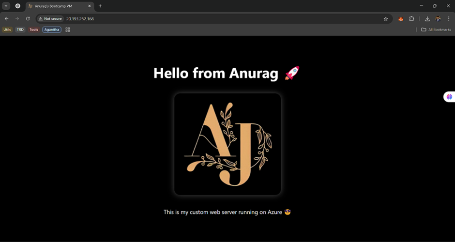

# Azure Bootcamp VM Setup: Static Web Server Deployment

This project documents how I (Anurag 🚀) set up a fully working Linux-based virtual machine (VM) on Microsoft Azure to serve a static website using NGINX. The goal was to display my name and photo on a custom HTML page served directly from the cloud. This was done completely via terminal access and remote tools like **PuTTY** and **WinSCP**.

---

## 🔧 Tools & Tech Stack Used

- **Microsoft Azure** – Cloud platform to host the VM  
- **Ubuntu 24.04 LTS** – Linux distribution running on the VM  
- **PuTTY** – SSH client for accessing the VM from Windows  
- **WinSCP** – File transfer tool for uploading files to the VM  
- **NGINX** – Lightweight web server used to serve the static page  
- **Terminal Commands** – Everything done via CLI on the VM  

---

## ☁️ VM Setup (Azure B1s)

- **VM Name:** `bootcamp-vm`  
- **Public IP:** `http://20.193.252.168/`  
- **OS:** Ubuntu 24.04.2 LTS  
- **Instance Type:** B1s (budget-friendly, lightweight for web hosting)  

---

## 🖥️ Connecting to the VM

### 1. Generate SSH Key (optional)
If you don't already have an SSH keypair, generate one using PuTTYgen.

### 2. Connect using PuTTY

- Hostname: `20.193.252.168`  
- Port: `22`  
- SSH Key: Load your `.ppk` file (if using key-based login)  
- Accept the SSH host key when prompted (⚠️ trust but verify)  

### 3. Login Credentials

- **Username:** `anurag`  
- **Password:** *(as configured in Azure)*  

---

## 🐧 Initial Setup on VM

### Update & Install NGINX

```
sudo apt update && sudo apt install nginx -y
````

### Check NGINX Status

```
systemctl status nginx
```

You should see `Active: running` and a default welcome page when visiting your IP.

---

## 📁 Folder Setup for HTML + Image

Navigate to the NGINX root directory:

```
cd /var/www/html/
```

Upload your photo using **WinSCP** into this directory.

Example:

* `photo.jpg` uploaded here using WinSCP.

Create your custom HTML:

```
sudo nano index.html
```

Paste this content:

```
<!DOCTYPE html>
<html>
  <head>
    <title>Anurag's Azure Web Server</title>
  </head>
  <body style="text-align:center; font-family:Arial;">
    <h1>Hello from Anurag 🚀</h1>
    
    <p>This is my custom web server running on Azure 😎</p>
  </body>
</html>
```

Save and exit (`CTRL + O`, `ENTER`, then `CTRL + X`).

Now visit your VM in the browser:

👉 [http://20.193.252.168/](http://20.193.252.168/)

Boom. You're live.

---

## 📤 File Upload Using WinSCP

1. Open **WinSCP** and connect using the same credentials as PuTTY.
2. Navigate to `/var/www/html/` on the VM side.
3. Drag and drop your image (e.g. `aj.jpg`) into that folder.

That image is now public and can be accessed via:

```
http://20.193.252.168/aj.jpg
```

---

## ✅ What You've Learned

* Creating and managing a cloud VM on Azure
* Using **PuTTY** for SSH access
* Using **WinSCP** for file transfer
* Installing and configuring **NGINX** on Ubuntu
* Hosting a live HTML page and image from a cloud server
* Living the DevOps dream one command at a time 🧪

---

## 🧠 Next Steps (Optional)

* Use `ufw` to secure your VM and allow only HTTP/HTTPS traffic.
* Add a domain name using Azure DNS or external registrar.
* Add SSL using Let's Encrypt for HTTPS.

---

## 🎉 Final Output



*"A server isn’t just a machine. It’s a mirror of the maker’s mind."* – Anurag

---

**Made with grit, code, and coffee.**


