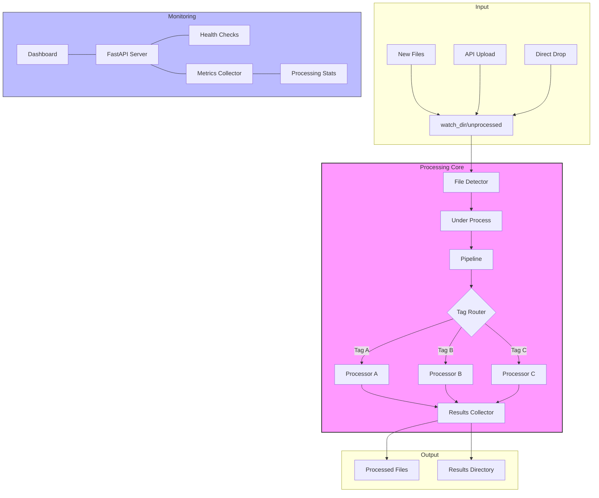
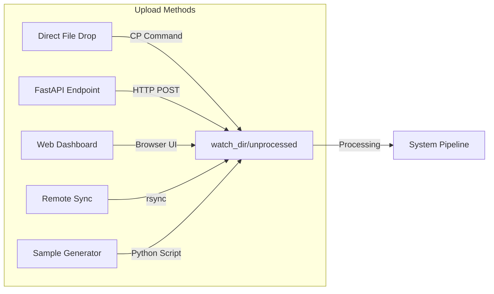
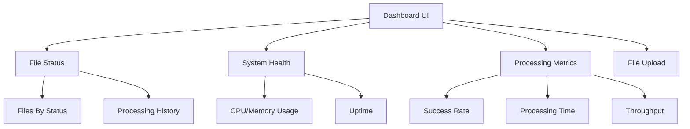
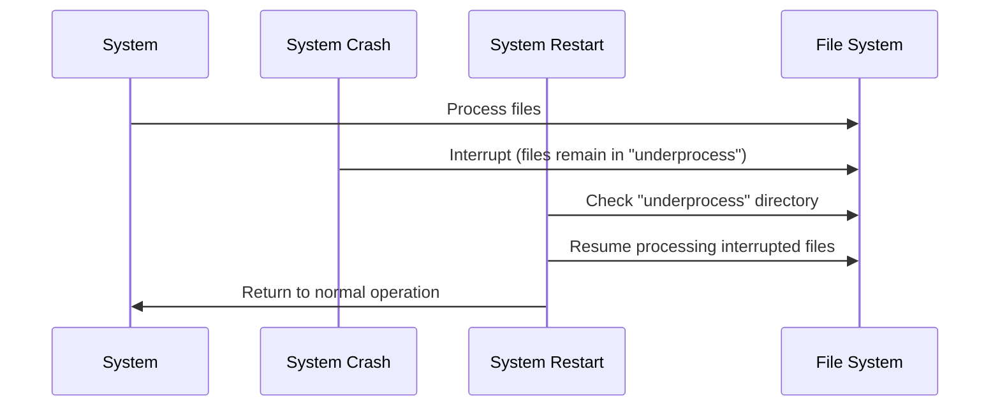

# 🚀 Real-Time File Processing System - Final Wrap-Up


> ### **Author: ANURAG**
> A powerful, resilient file processing framework with real-time monitoring, state-based routing, and self-healing capabilities. Built for reliability and extensibility with support for both stream and batch processing paradigms.


## ✨ Key Features

- **Modular Processing Engine**: Extensible pipeline for file processing
- **Stream-based Pipeline**: Process files as streams for efficiency
- **Tag-based Router**: Route files to different processors based on content
- **Web Dashboard**: Monitor system health and processing statistics
- **Folder Monitoring**: Automatically detect and process new files
- **Self-healing**: Recover from failures and continue processing
- **Dual Execution Modes**: Process a single file or watch a directory
- **Docker Support**: Run the system in a containerized environment
- **Comprehensive Metrics**: Track processing times, success rates, and more

## 🏗️ Architecture



## 🚀 Quick Start

### Prerequisites

- Python 3.13
- Docker (optional)
- Make (optional, for Makefile usage)

### Installation

#### Local Installation

1. Clone the repository:

```bash
git clone https://github.com/ANURAGJAMANKAR/bootcamp.git
cd AGANITHA_BOOTCAMP
```

2. Create a virtual environment:

```bash
python -m venv venv
source venv/bin/activate  # On Windows: venv\Scripts\activate
```

3. Install dependencies:

```bash
pip install -r requirements.txt
```

4. Create required directories:

```bash
mkdir -p watch_dir/unprocessed watch_dir/processed watch_dir/underprocess results
```

#### Docker Installation

Build and run using Docker:

```bash
# Build the image
docker build -t file-processor:latest .

# Run the container
docker run -p 8000:8000 -v $(pwd)/watch_dir:/app/watch_dir -v $(pwd)/results:/app/results file-processor:latest
```

On Windows (PowerShell):

```powershell
docker run -p 8000:8000 -v ${PWD}/watch_dir:/app/watch_dir -v ${PWD}/results:/app/results file-processor:latest
```

Or use Docker Compose:

```bash
# Start the service
docker-compose up -d

# View logs
docker-compose logs -f
```

## 📝 Usage

### Running the System

The system supports two operation modes:

#### 1. Watch Mode (Continuous)

Continuously monitors the `watch_dir/unprocessed/` directory for new files:

```bash
# Using Makefile
make run

# Using run.sh
./run.sh run

# Using Python directly
python main.py --watch
```

#### 2. Single File Mode (One-shot)

Processes a single file and exits:

```bash
# Using Makefile
make run-file FILE=path/to/file.txt

# Using run.sh
./run.sh run-file path/to/file.txt

# Using Python directly
python main.py --input path/to/file.txt
```

### Command Line Options

```
--watch                 Run in watch mode (monitor directory)
--input PATH            Process a single file at PATH
--config PATH           Path to configuration file (default: log_processor_config.json)
--debug                 Enable debug logging
--trace                 Enable trace logging (more verbose than debug)
```

### Common Operations

Use the Makefile or run.sh for common tasks:

```bash
# Show help
make help
./run.sh help

# Clean up processed files and logs
make clean
./run.sh clean

# Build Docker image
make build-docker
./run.sh build-docker

# Run in Docker container
make run-docker
./run.sh run-docker

# Build Python package
make build-package
./run.sh build-package

# Publish package to PyPI 
make publish-package
./run.sh publish-package
```

## 📤 File Upload Methods

Files can be uploaded to the system in several ways:



1. **Direct File Drop**
   ```bash
   cp your_file.txt watch_dir/unprocessed/
   ```

2. **FastAPI Upload Endpoint**
   ```bash
   curl -X POST "http://localhost:8000/upload" \
     -H "Content-Type: multipart/form-data" \
     -F "file=@your_file.txt"
   ```

3. **Web Dashboard**
   Access the web dashboard at [http://localhost:8000](http://localhost:8000) and use the file upload interface.

4. **Remote Sync (rsync)**
   ```bash
   rsync -avz /path/to/source/files/ user@server:/path/to/watch_dir/unprocessed/
   ```

5. **Sample Data Generation**
   ```bash
   python generate_sample_logs.py --count 5 --output watch_dir/unprocessed/
   ```

## 🔌 API Endpoints

The system provides a REST API through the FastAPI dashboard server:

| Endpoint | Method | Description |
|----------|--------|-------------|
| `/health` | GET | System health status and metrics |
| `/stats` | GET | Processing statistics |
| `/files` | GET | List of processed files with status |
| `/upload` | POST | Upload a file for processing |

Example request to check system health:

```bash
curl -X GET "http://localhost:8000/health"
```

## 📊 Monitoring

### Local Monitoring

Access the dashboard at [http://localhost:8000](http://localhost:8000) to view system status, metrics, and processed files.



### Remote Monitoring

The system can be monitored using Better Uptime:

1. Create an account at [Better Uptime](https://betteruptime.com/)
2. Add a new monitor pointing to your system's `/health` endpoint
3. Configure alerts for downtime notifications

## 📂 Project Structure

```
file-processing-system/
├── config/                     # Configuration management
├── dashboard/                  # Web dashboard (FastAPI)
├── folder_monitor/             # Directory monitoring
├── metrics/                    # Metrics collection
├── pipeline/                   # Processing pipeline
├── processors/                 # File processors
├── results/                    # Output directory
├── watch_dir/                  # Directory structure for file monitoring
│   ├── processed/              # Successfully processed files
│   ├── underprocess/           # Files currently being processed
│   └── unprocessed/            # New files waiting to be processed
├── Dockerfile                  # Docker configuration
├── FINAL.md                    # Project reflection
├── Makefile                    # Commands for operations
├── README.md                   # This file
├── generate_sample_logs.py     # Utility script
├── log_processor_config.json   # Main configuration
├── main.py                     # Entry point
├── pipeline_config.json        # Pipeline configuration
├── requirements.txt            # Dependencies
├── run.sh                      # Shell script alternative
└── setup.py                    # Package setup
```

## ⚙️ Configuration

The system is configured via two main JSON files:

### Main Configuration (log_processor_config.json)

```json
{
  "watch_dir": "watch_dir",
  "processors": ["simple", "stateful"],
  "dashboard": {
    "host": "0.0.0.0",
    "port": 8000
  },
  "recovery": {
    "enabled": true,
    "check_interval": 60
  }
}
```

### Pipeline Configuration (pipeline_config.json)

```json
{
  "pipeline": {
    "steps": [
      {
        "name": "parse",
        "processor": "simple"
      },
      {
        "name": "analyze",
        "processor": "stateful"
      }
    ]
  }
}
```

## 💻 Development

### Adding New Processors

1. Create a new processor class in the `processors/` directory:

```python
# processors/my_processor.py
from processors.base import BaseProcessor

class MyProcessor(BaseProcessor):
    def __init__(self, config=None):
        super().__init__(config)
        self.name = "my_processor"
        
    def process(self, content, metadata=None):
        # Process the content
        processed_content = content.upper()
        return processed_content, metadata
```

2. Update the configuration to use your processor:

```json
{
  "processors": ["simple", "stateful", "my_processor"]
}
```

### Extending the Pipeline

Modify the pipeline_config.json file to add new steps:

```json
{
  "pipeline": {
    "steps": [
      {
        "name": "parse",
        "processor": "simple"
      },
      {
        "name": "analyze",
        "processor": "stateful"
      },
      {
        "name": "transform",
        "processor": "my_processor"
      }
    ]
  }
}
```

## ❓ Troubleshooting

### Common Issues

#### Files Not Being Processed

- Check file permissions
- Verify correct directory placement
- Run with `--debug` flag to see more information
- Ensure watch mode is active

#### Dashboard Not Accessible

- Verify server is running
- Check port availability
- Ensure network access to port 8000
- Check logs for binding errors

#### Docker Issues

- Confirm Docker is running
- Check volume mounts
- Verify port mapping
- Check container logs

### Recovery Process



The system automatically recovers interrupted processing:

1. Files being processed during a crash are preserved in `watch_dir/underprocess/`
2. Upon restart, the system checks this directory and resumes processing
3. To manually trigger recovery: `python main.py --watch`

## 🤝 Contributing

Contributions are welcome! Please follow these steps:

1. Fork the repository
2. Create a feature branch: `git checkout -b feature/my-feature`
3. Make your changes
4. Add tests for your changes
5. Run tests: `pytest`
6. Commit your changes: `git commit -am 'Add my feature'`
7. Push to the branch: `git push origin feature/my-feature`
8. Submit a pull request

## 📜 License

This project is licensed under the MIT License.

```
MIT License

Copyright (c) 2025 Anurag

Permission is hereby granted, free of charge, to any person obtaining a copy
of this software and associated documentation files (the "Software"), to deal
in the Software without restriction, including without limitation the rights
to use, copy, modify, merge, publish, distribute, sublicense, and/or sell
copies of the Software, and to permit persons to whom the Software is
furnished to do so, subject to the following conditions:

The above copyright notice and this permission notice shall be included in all
copies or substantial portions of the Software.

THE SOFTWARE IS PROVIDED "AS IS", WITHOUT WARRANTY OF ANY KIND, EXPRESS OR
IMPLIED, INCLUDING BUT NOT LIMITED TO THE WARRANTIES OF MERCHANTABILITY,
FITNESS FOR A PARTICULAR PURPOSE AND NONINFRINGEMENT. IN NO EVENT SHALL THE
AUTHORS OR COPYRIGHT HOLDERS BE LIABLE FOR ANY CLAIM, DAMAGES OR OTHER
LIABILITY, WHETHER IN AN ACTION OF CONTRACT, TORT OR OTHERWISE, ARISING FROM,
OUT OF OR IN CONNECTION WITH THE SOFTWARE OR THE USE OR OTHER DEALINGS IN THE
SOFTWARE.
```

## 🙏 Acknowledgments

- This project was developed as part of a multi-level learning exercise
- Thanks to all contributors and testers
- Special thanks to the open-source community for libraries used in this project

## ✅ Final Checklist

- [x] Makefile (or run.sh) supports all major commands
- [x] System runs in both one-shot and continuous modes
- [x] Users can interact via CLI, file drop, or browser
- [x] All code committed and properly structured
- [x] Documentation includes deployment and monitoring instructions
- [x] Docker support with proper volume mounting
- [x] Configuration files are properly documented
- [x] Error handling and recovery mechanisms in place
- [x] API endpoints documented and functional
- [x] Performance metrics and health checks implemented

## 📝 Project Reflection

### 1. Design Decisions

The most important architectural choices in this project centered around modularity and resilience. By implementing a pipeline-based approach with pluggable processors, the system gained extreme flexibility without sacrificing simplicity. Each processor becomes a self-contained unit that can be developed and tested independently.

The abstraction that helped the most was the tag-based router. This allowed files to flow through different processing paths based on their content, creating a dynamic and adaptive system that can handle diverse input types without code changes. This approach was inspired by finite state machines, where the current state (tag) determines the next processing step.

The stream-based processing model was another crucial choice, allowing the system to efficiently handle files of any size without excessive memory usage. By processing files as they are read, rather than loading them entirely into memory, the system maintains consistent performance regardless of input size.

### 2. Tradeoffs

Several simplifications were made to keep the project manageable:

- The system currently lacks authentication and authorization for the API endpoints
- Error handling is robust but not exhaustive for all edge cases
- The dashboard provides essential metrics but could be enhanced with more visualizations
- File type detection is primarily based on content rather than more sophisticated approaches

The current limitations include:
- Limited parallel processing capabilities
- No built-in support for distributed deployment
- Minimal validation for uploaded files
- Lack of sophisticated rate limiting for API endpoints

These limitations were acceptable trade-offs given the project scope, but would need to be addressed for enterprise deployment.

### 3. Scalability

If the input volume increased 100x, several changes would be necessary:

1. **Implement worker pools**: Replace the current sequential processing with a pool of worker processes to handle multiple files concurrently.

2. **Add message queuing**: Introduce a message queue (RabbitMQ/Kafka) to decouple file detection from processing, allowing better load management.

3. **Database integration**: Replace file-based status tracking with a proper database to handle increased metadata volume.

4. **Horizontal scaling**: Modify the architecture to support running multiple processing nodes that share the workload.

Parallelizing processing safely would require adding file locking mechanisms, transaction-like semantics for the pipeline, and careful state management to prevent race conditions.

### 4. Extensibility & Security

To prepare this system for real-world users, several enhancements would be needed:

**Security improvements:**
- Add authentication for API endpoints using OAuth 2.0 or API keys
- Implement input validation and sanitization for all user-provided data
- Add virus/malware scanning for uploaded files
- Create proper user isolation for multi-tenant deployments
- Encrypt sensitive data in transit and at rest

**Production readiness:**
- Add comprehensive logging with proper log rotation and retention
- Implement proper secrets management for configurations
- Set up backup and disaster recovery procedures
- Create deployment scripts for cloud environments (AWS, GCP, Azure)
- Implement CI/CD pipelines for automated testing and deployment

With these enhancements, the system would be ready for production use while maintaining its core strengths of flexibility, resilience, and observability.
