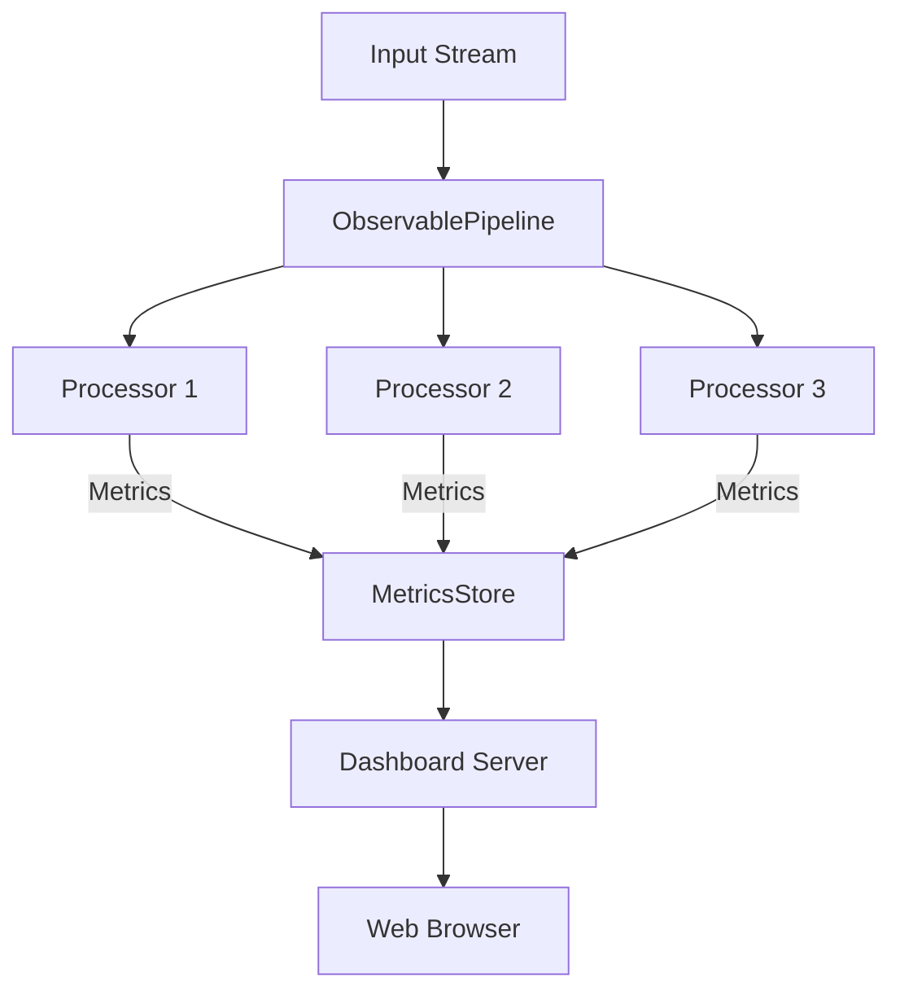
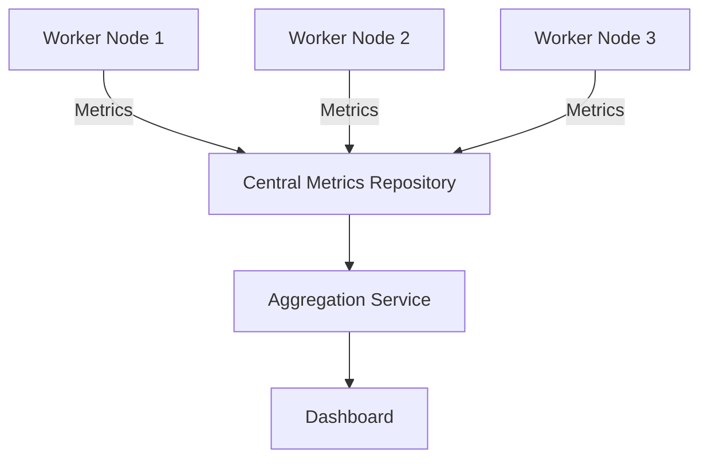

# 🔍 Observability and System Introspection - Level 7
**Author:** ANURAG

[](https://opensource.org/licenses/MIT)
[](https://www.python.org/downloads/)
[](https://fastapi.tiangolo.com/)

## 📋 Description

A comprehensive real-time observability layer for stream processing systems that makes complex data pipelines transparent and measurable. This dashboard-enabled solution provides metrics tracking, execution tracing, and visual insights through an interactive web interface while maintaining high performance and thread safety.

## ✨ Features

- **📊 Metrics Collection**: Track lines in/out, processing time, and errors for each processor
- **🔄 Execution Tracing**: Follow the journey of each line through the processing pipeline
- **📈 Web Dashboard**: Real-time visualization of system metrics and traces
- **🔒 Thread-Safe Design**: Concurrent access to metrics from processing and dashboard threads
- **⚙️ Configurable Pipeline**: JSON-based configuration for processor setup

## 🌍 Real-World Motivation

In production systems:
- **Data engineers** want to know how many records passed through each node
- **Operators** want to see what part of the system is slow or overloaded
- **Developers** want to debug flows by seeing how a record moved through the DAG
- **Teams** want dashboards to monitor uptime, alerts, and live status

Similar to tools like:
- Apache Spark's UI
- Airflow's DAG view
- Kubernetes dashboard
- Prometheus + Grafana

## 📥 Installation

```bash
# Clone the repository
git clone https://github.com/ANURAGJAMANKAR/bootcamp.git
cd cd bootcamp/AganithaBootcamp/day_four/level_7_observability_and_system_introspection

# Install dependencies
pip install fastapi uvicorn
```

### Dependencies

```
fastapi==0.115.12
uvicorn==0.34.2
pydantic==2.11.4
```

## 📂 File Structure

```
level_7_observability_and_system_introspection/
├── README.md
├── metrics/
│   ├── __init__.py
│   ├── metrics_store.py     # Centralized storage for metrics and traces
│   └── tracer.py            # Trace collection and management
├── processors/
│   ├── __init__.py
│   ├── base.py              # Observable processor base class
│   ├── simple.py            # Basic processors (filter, uppercase, etc.)
│   └── stateful.py          # Processors with state (counter, router)
├── pipeline/
│   ├── __init__.py
│   └── pipeline.py          # Main pipeline implementation
├── dashboard/
│   ├── __init__.py
│   └── server.py            # FastAPI web dashboard
├── config/
│   ├── __init__.py
│   └── config_loader.py     # JSON configuration handler
└── main.py                  # Entry point and CLI
```

## 🔑 Core Features

### 1. Metrics Layer
- Count of lines received and emitted per processor
- Processing time per processor
- Number of exceptions or errors
- All metrics accessible via API endpoints

### 2. Execution Tracing
- Each line optionally carries a trace of its journey (e.g., `["start", "warn", "end"]`)
- Traces stored for a recent window (last 1000 lines)
- Optional `--trace` flag enables this feature

### 3. Web Dashboard
- Built using **FastAPI**
- Runs on a separate thread while processing continues
- Exposes endpoints:
  - `/stats`: Live processor metrics
  - `/trace`: Recent traces (top 100)
  - `/errors`: Processor-level error logs
- Simple JSON or HTML/JS interface

### 4. Concurrency Design
- Dashboard reads from shared memory structures
- Uses `threading` and locks for thread safety
- System remains responsive during processing

## 🚀 Quick Start

<details open>
<summary>🚀 <b>Getting Started</b></summary>

### Process a file with tracing and dashboard

```bash
python main.py --file input.txt --output result.txt --trace --dashboard
```

Then open your browser to [http://localhost:8000](http://localhost:8000) to view the dashboard.

</details>

<details>
<summary>⚙️ <b>Advanced Usage Options</b></summary>

### Use a custom configuration

```bash
python main.py --file input.txt --config pipeline_config.json --trace --dashboard
```

### Just run the dashboard (for demonstration)

```bash
python main.py --dashboard
```

### Run with specific dashboard port

```bash
python main.py --file input.txt --dashboard-port 9000
```

### Save metrics to a file

```bash
python main.py --file input.txt --save-metrics metrics.json
```

</details>

## 📊 Dashboard

The web dashboard is available at [http://localhost:8000](http://localhost:8000) when enabled with the `--dashboard` flag.

The dashboard provides:

- **Processor Metrics** (`/stats`): Lines in/out, processing time, and error counts
- **Traces** (`/trace`): The path of lines through the system (when enabled with `--trace`)
- **Errors** (`/errors`): Recent errors with processor information

### Dashboard Visualization

Below are screenshots of the dashboard in action:

#### Main Dashboard - Widget

*The main dashboard shows a complete overview of the system with summary metrics*

#### Main Dashboard - Trace Log

*The main dashboard shows a complete overview of the system with summary metrics*

#### Main Dashboard - Error Log

*The main dashboard shows a complete overview of the system with summary metrics*


#### Stats View

*Detailed processor-level metrics showing throughput and performance statistics*

#### Trace View

*Visualization of data flow through the processing pipeline with timing information*

#### Error Monitoring

*Error tracking with detailed context information for troubleshooting*

## ⚙️ Configuration

You can configure processors using a JSON file:

```json
{
  "processors": [
    {
      "type": "line_counter",
      "id": "counter",
      "format": "Line {count}: {line}"
    },
    {
      "type": "uppercase",
      "id": "uppercase"
    },
    {
      "type": "filter",
      "id": "important_filter",
      "pattern": "important"
    }
  ]
}
```

## 📝 Example Scenario

Imagine processing a log file with different log levels (INFO, WARN, ERROR). With the observability system, you can:

1. See how many lines were tagged as `error`, `warn`, `info`
2. Measure how long it took to process them
3. Track which path each line took through the DAG
4. Identify which processor is slowest or throwing errors

You can visit `http://localhost:8000/stats` to immediately answer these questions.

<details>
<summary>📊 <b>Click to see example metrics output</b></summary>

```json
{
  "processors": {
    "line_counter": {
      "lines_in": 1000,
      "lines_out": 1000,
      "processing_time_ms": 15.7,
      "errors": 0
    },
    "tag_extractor": {
      "lines_in": 1000,
      "lines_out": 1000,
      "processing_time_ms": 25.3,
      "errors": 0
    },
    "error_filter": {
      "lines_in": 1000,
      "lines_out": 57,
      "processing_time_ms": 10.2,
      "errors": 0
    },
    "warn_filter": {
      "lines_in": 1000,
      "lines_out": 143,
      "processing_time_ms": 9.8,
      "errors": 0
    },
    "info_filter": {
      "lines_in": 1000,
      "lines_out": 800,
      "processing_time_ms": 9.5,
      "errors": 0
    }
  },
  "system": {
    "total_lines": 1000,
    "total_processing_time_ms": 70.5,
    "lines_per_second": 14184.4,
    "total_errors": 0
  }
}
```

</details>

## 🏗️ Architecture

<details open>
<summary>🏗️ <b>Core Components</b></summary>

- **MetricsStore**: Singleton for storing metrics and traces
- **ObservableProcessor**: Base class for processors that collect metrics
- **Dashboard**: FastAPI web server for monitoring
- **ObservablePipeline**: Chains processors together



</details>

<details>
<summary>📊 <b>Metrics Collection</b></summary>

Each processor collects:

- Count of lines received
- Count of lines emitted
- Processing time
- Errors

Example metrics output:

```json
{
  "processor_id": "uppercase_filter",
  "metrics": {
    "lines_in": 1432,
    "lines_out": 926,
    "processing_time_ms": 128.5,
    "errors": 0
  }
}
```

</details>

<details>
<summary>🔍 <b>Tracing</b></summary>

When enabled with the `--trace` flag, the system tracks:

- The original line content
- Each processor the line passes through
- The status at each step (start, emit, drop, error)

Example trace output:

```json
{
  "line_id": "abc123",
  "original_content": "ERROR: Connection timed out",
  "path": [
    {"processor": "line_reader", "status": "emit", "timestamp": 1620753601.234},
    {"processor": "error_filter", "status": "match", "timestamp": 1620753601.236},
    {"processor": "error_counter", "status": "emit", "timestamp": 1620753601.237}
  ]
}
```

</details>

<details>
<summary>🔒 <b>Thread Safety</b></summary>

All metrics and trace data are protected by locks to ensure thread safety when accessed concurrently by:

- The main processing thread
- The dashboard server thread

```python
# Example of thread-safe metrics update
def update_metrics(self, metric_name, value):
    with self.metrics_lock:
        self.metrics[metric_name] += value
```

</details>

## 🌐 Advanced Topics

<details>
<summary>🌐 <b>Multi-Machine Considerations</b></summary>

In a distributed environment:

- Centralized metrics repository (like Prometheus or InfluxDB)
- Distributed tracing with correlation IDs
- Aggregation of metrics from multiple nodes
- Network latency compensation in measurements



</details>

<details>
<summary>🚀 <b>Production Improvements</b></summary>

For a production system:

- Historical metrics with time-series graphs
- Alerting capabilities for error conditions
- User authentication and role-based access
- Detailed resource utilization metrics (CPU, memory)
- Drill-down capabilities for specific traces or errors
- Export features for offline analysis

</details>

## ✅ Checklist

- [ ] Shared metrics store updated by each processor
- [ ] Each processor can emit tagged trace data
- [ ] Metrics and trace data exposed through FastAPI endpoints
- [ ] Dashboard runs concurrently without blocking main processor
- [ ] User can enable/disable tracing with CLI flag
- [ ] Recent errors are accessible via API
- [ ] System remains responsive under load
- [ ] Thread safety is maintained for all shared resources
- [ ] Dashboard provides useful visualization of system state
- [ ] Configuration is flexible through JSON files

## 📄 License

MIT License

Copyright (c) 2025 KANAN

Permission is hereby granted, free of charge, to any person obtaining a copy
of this software and associated documentation files (the "Software"), to deal
in the Software without restriction, including without limitation the rights
to use, copy, modify, merge, publish, distribute, sublicense, and/or sell
copies of the Software, and to permit persons to whom the Software is
furnished to do so, subject to the following conditions:

The above copyright notice and this permission notice shall be included in all
copies or substantial portions of the Software.

THE SOFTWARE IS PROVIDED "AS IS", WITHOUT WARRANTY OF ANY KIND, EXPRESS OR
IMPLIED, INCLUDING BUT NOT LIMITED TO THE WARRANTIES OF MERCHANTABILITY,
FITNESS FOR A PARTICULAR PURPOSE AND NONINFRINGEMENT. IN NO EVENT SHALL THE
AUTHORS OR COPYRIGHT HOLDERS BE LIABLE FOR ANY CLAIM, DAMAGES OR OTHER
LIABILITY, WHETHER IN AN ACTION OF CONTRACT, TORT OR OTHERWISE, ARISING FROM,
OUT OF OR IN CONNECTION WITH THE SOFTWARE OR THE USE OR OTHER DEALINGS IN THE
SOFTWARE.
