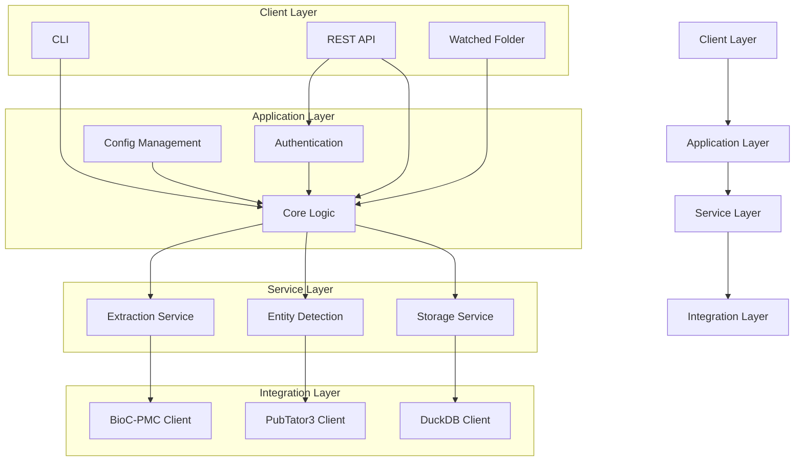
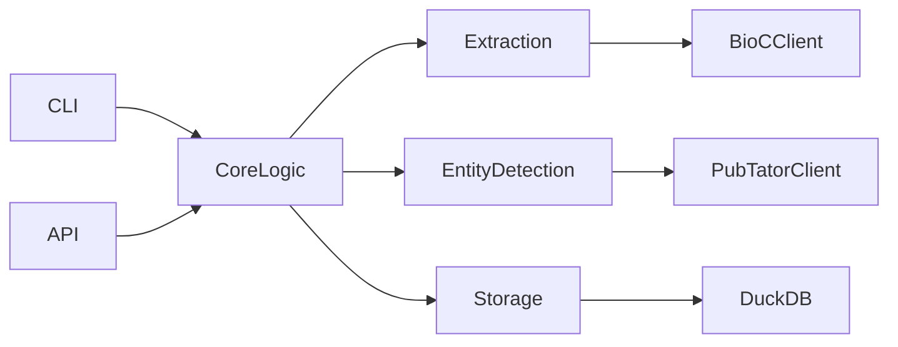

# Scientific Publication Data Extraction System

## 1. System Overview

The Scientific Publication Data Extraction System is designed to extract, store, and provide access to scientific publication metadata with a focus on figure captions and related entities.

### 1.1 System Purpose

The system will extract the following information from scientific publications:

* Title
* Abstract
* Figure captions
* Figure URLs (when available)
* Key entities (e.g., genes) mentioned in figure captions

The system initially targets PubMed Central (PMC) publications and is extensible to other sources.

## 2. Architecture

### 2.1 High-Level Architecture



### 2.2 Component Descriptions

#### Client Layer

* **CLI**: Submit paper IDs, query data, run jobs, export results.
* **REST API**: Enables programmatic access; includes authentication, submission, querying, and export.
* **Watched Folder**: Auto-processes files placed in designated directories.

#### Application Layer

* **Authentication**: Secures system access via API keys and permissions.
* **Core Logic**: Coordinates data flow, manages tasks, handles retries.
* **Config Management**: Stores and validates configurations.

#### Service Layer

* **Extraction**: Connects to PMC, extracts metadata, structures output.
* **Entity Detection**: Interfaces with PubTator3, filters entities.
* **Storage**: Persists and manages metadata in DuckDB.

#### Integration Layer

* **BioC-PMC Client**: Fetches structured publication data.
* **PubTator3 Client**: Handles entity recognition.
* **DuckDB Client**: Manages local SQL database interaction.

## 3. Data Models

```plaintext
Paper {
    id: string
    title: string
    abstract: string
    processed_date: datetime
    source: string
    status: enum ["pending", "processing", "completed", "failed"]
    error_message: string
}

Figure {
    id: string
    paper_id: string
    figure_number: int
    caption: string
    url: string
}

Entity {
    id: string
    figure_id: string
    entity_text: string
    entity_type: string
    start_position: int
    end_position: int
    external_id: string
}

Job {
    id: string
    job_type: string
    status: enum ["queued", "processing", "completed", "failed"]
    created_at: datetime
    completed_at: datetime
    paper_ids: array<string>
    total_papers: int
    processed_papers: int
    failed_papers: int
}
```

## 4. Data Flow

### 4.1 Ingestion

1. User submits paper IDs (CLI/API/folder)
2. System queues IDs for processing
3. Extraction retrieves data from PMC
4. Entity detection runs on figure captions
5. Storage saves structured results
6. Job status updated and user notified

### 4.2 Query

1. User queries via CLI or API
2. Auth is validated
3. Query executed on DuckDB
4. Results formatted
5. Results returned to user

## 5. Technical Stack

* **Language**: Python 3.9+
* **Web Framework**: FastAPI
* **CLI**: Typer
* **Database**: DuckDB
* **ORM**: SQLAlchemy
* **HTTP Client**: httpx
* **Task Queue**: Celery + Redis
* **Containerization**: Docker + Docker Compose
* **Testing**: pytest
* **Docs**: Sphinx (ReadTheDocs theme)

## 6. API Endpoints

### Authentication

* `POST /api/v1/auth/token`

### Papers

* `POST /api/v1/papers`
* `GET /api/v1/papers`
* `GET /api/v1/papers/{paper_id}`
* `GET /api/v1/papers/{paper_id}/figures`

### Figures

* `GET /api/v1/figures`
* `GET /api/v1/figures/{figure_id}`
* `GET /api/v1/figures/{figure_id}/entities`

### Entities

* `GET /api/v1/entities`
* `GET /api/v1/entities/{type}`

### Jobs

* `GET /api/v1/jobs`
* `GET /api/v1/jobs/{job_id}`
* `POST /api/v1/jobs/{job_id}/cancel`

### Export

* `GET /api/v1/export/papers`
* `GET /api/v1/export/figures`
* `GET /api/v1/export/entities`

### Admin

* `GET /api/v1/admin/config`
* `PUT /api/v1/admin/config`
* `GET /api/v1/admin/stats`

## 7. Configuration

### General

* `app_name`, `environment`, `log_level`, `temp_dir`

### API

* `api_host`, `api_port`, `api_workers`, `enable_docs`

### Security

* `auth_enabled`, `auth_method`, `api_keys`, `token_expiration`

### Storage

* `storage_type`, `duckdb_path`, `backup_enabled`, `backup_interval`

### Processing

* `extraction_workers`, `entity_detection_workers`, `batch_size`, `retry_limit`, `retry_delay`

### Watched Folder

* `watched_folders`, `watch_interval`, `file_patterns`

### External APIs

* `bioc_pmc_url`, `bioc_pmc_rate_limit`, `pubtator3_url`, `pubtator3_rate_limit`

## 8. Deployment Diagram

*(Mermaid diagram placeholder — to be rendered in compatible viewer)*



# 📚 Scientific Publication Data Extraction System

## 🧠 Overview

This system extracts metadata from scientific publications — focusing on **figure captions** and **related biological entities** like genes. It supports multiple interfaces (CLI, REST API, watched folders) and stores results in a DuckDB database.

Initially scoped to **PubMed Central (PMC)**, but designed for easy expansion.


## 🏛️ Architecture

```mermaid
graph TD
    A["Client Layer"] --> B["Application Layer"]
    B --> C["Service Layer"]
    C --> D["Integration Layer"]

    subgraph "Client Layer"
    A1["CLI"] 
    A2["REST API"]
    A3["Watched Folder"]
    end

    subgraph "Application Layer"
    B1["Authentication"]
    B2["Core Logic"]
    B3["Config Management"]
    end

    subgraph "Service Layer"
    C1["Extraction Service"]
    C2["Entity Detection"]
    C3["Storage Service"]
    end

    subgraph "Integration Layer"
    D1["BioC-PMC Client"]
    D2["PubTator3 Client"]
    D3["DuckDB Client"]
    end

    A1 --> B2
    A2 --> B1
    A2 --> B2
    A3 --> B2

    B1 --> B2
    B2 --> C1
    B2 --> C2
    B2 --> C3
    B3 --> B2

    C1 --> D1
    C2 --> D2
    C3 --> D3
````

---

## 🧩 Components

### 🔌 Client Layer

* **CLI**: Run batch jobs, submit papers, export data
* **REST API**: Programmatic access with auth
* **Watched Folder**: Auto-process paper ID files

### ⚙️ Application Layer

* **Authentication**: API key validation, admin controls
* **Core Logic**: Manages data flow, retries, and job queues
* **Config Management**: Centralized system settings

### 🧪 Service Layer

* **Extraction**: Scrapes titles, abstracts, figures from PMC
* **Entity Detection**: Uses PubTator3 to ID biological terms
* **Storage**: Writes everything to DuckDB

### 🔗 Integration Layer

* **BioC-PMC Client**: Handles PMC XML APIs
* **PubTator3 Client**: Detects entities
* **DuckDB Client**: Talks to the DB

---

## 📦 Data Models

<details>
<summary><strong>Paper</strong></summary>

```json
{
  "id": "PMC123456",
  "title": "Example Title",
  "abstract": "...",
  "processed_date": "2024-12-01T12:00:00Z",
  "source": "PMC",
  "status": "completed",
  "error_message": null
}
```

</details>

<details>
<summary><strong>Figure</strong></summary>

```json
{
  "id": "fig1",
  "paper_id": "PMC123456",
  "figure_number": 1,
  "caption": "...",
  "url": "http://..."
}
```

</details>

<details>
<summary><strong>Entity</strong></summary>

```json
{
  "id": "ent1",
  "figure_id": "fig1",
  "entity_text": "BRCA1",
  "entity_type": "gene",
  "start_position": 5,
  "end_position": 10,
  "external_id": "HGNC:1100"
}
```

</details>

<details>
<summary><strong>Job</strong></summary>

```json
{
  "id": "job-001",
  "job_type": "paper-extraction",
  "status": "processing",
  "created_at": "...",
  "completed_at": null,
  "paper_ids": ["PMC123456"],
  "total_papers": 1,
  "processed_papers": 0,
  "failed_papers": 0
}
```

</details>

---

## 🔄 Data Flow

### Ingestion

1. User submits IDs (CLI, API, or folder)
2. Job is queued
3. For each paper:

   * Title/abstract/figures extracted
   * Entity detection on captions
   * Stored in DuckDB
4. Job is marked complete

### Querying

1. User sends query (API/CLI)
2. Auth validated
3. Query executed on DuckDB
4. JSON/CSV returned

---

## 🛠 Technical Stack

| Category         | Tool / Decision            | Reasoning                       |
| ---------------- | -------------------------- | ------------------------------- |
| Language         | Python 3.9+                | Bio + NLP libs, fast dev        |
| Web API          | FastAPI                    | Async, OpenAPI, typing          |
| CLI              | Typer                      | Modern Click-based CLI          |
| Database         | DuckDB                     | Fast, local OLAP queries        |
| ORM              | SQLAlchemy                 | Full-featured, FastAPI-friendly |
| HTTP Client      | httpx                      | Async, modern                   |
| Task Queue       | Celery + Redis             | Distributed job processing      |
| Containerization | Docker + Docker Compose    | Easy deployment                 |
| Testing          | pytest                     | Battle-tested                   |
| Docs             | Sphinx + ReadTheDocs Theme | Python ecosystem standard       |

---

## 🌐 API Endpoints (v1)

### 🧾 Auth

* `POST /api/v1/auth/token`

### 📄 Papers

* `POST /api/v1/papers`
* `GET /api/v1/papers`
* `GET /api/v1/papers/{paper_id}`
* `GET /api/v1/papers/{paper_id}/figures`

### 🖼 Figures

* `GET /api/v1/figures`
* `GET /api/v1/figures/{figure_id}`
* `GET /api/v1/figures/{figure_id}/entities`

### 🧬 Entities

* `GET /api/v1/entities`
* `GET /api/v1/entities/{type}`

### 🧵 Jobs

* `GET /api/v1/jobs`
* `GET /api/v1/jobs/{job_id}`
* `POST /api/v1/jobs/{job_id}/cancel`

### 📤 Export

* `GET /api/v1/export/papers`
* `GET /api/v1/export/figures`
* `GET /api/v1/export/entities`

### 🛡 Admin

* `GET /api/v1/admin/config`
* `PUT /api/v1/admin/config`
* `GET /api/v1/admin/stats`

---

## ⚙️ Configuration

<details>
<summary><strong>General</strong></summary>

```yaml
app_name: PubFigureExtract
environment: development
log_level: INFO
temp_dir: /tmp/data
```

</details>

<details>
<summary><strong>API</strong></summary>

```yaml
api_host: 0.0.0.0
api_port: 8000
api_workers: 4
enable_docs: true
```

</details>

<details>
<summary><strong>Security</strong></summary>

```yaml
auth_enabled: true
auth_method: api_key
api_keys: ["secret123"]
token_expiration: 3600
```

</details>

<details>
<summary><strong>Storage</strong></summary>

```yaml
storage_type: duckdb
duckdb_path: ./data/pubdata.duckdb
backup_enabled: true
backup_interval: 12
```

</details>

<details>
<summary><strong>Processing</strong></summary>

```yaml
extraction_workers: 2
entity_detection_workers: 2
batch_size: 10
retry_limit: 3
retry_delay: 5
```

</details>

<details>
<summary><strong>Watched Folder</strong></summary>

```yaml
watched_folders: ["./watch"]
watch_interval: 30
file_patterns: ["*.txt"]
```

</details>

<details>
<summary><strong>External APIs</strong></summary>

```yaml
bioc_pmc_url: "https://api.ncbi.nlm.nih.gov/bioc"
bioc_pmc_rate_limit: 10
pubtator3_url: "https://www.ncbi.nlm.nih.gov/research/pubtator3"
pubtator3_rate_limit: 5
```

</details>

---

## 🚀 Deployment

```bash
docker-compose up --build
```

📦 Services:

* API (FastAPI)
* CLI tools
* Redis (queue backend)
* DuckDB (persistent storage)

---

## 🧪 Tests

```bash
pytest
```

---

## 👨‍🔬 Maintained by: Anurag

> Bringing structure to the chaos of scientific literature.

---

